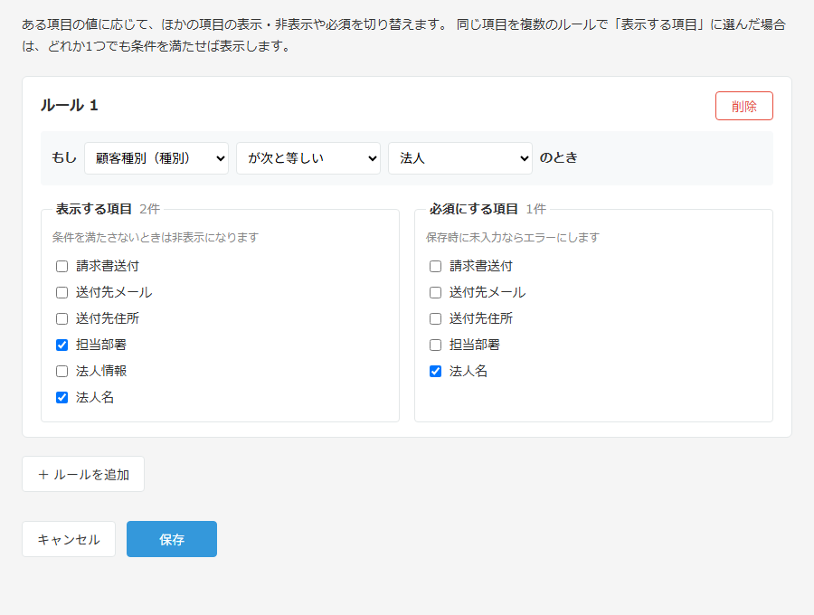

# 条件付き表示・必須プラグイン for kintone

[](https://github.com/Ryosukekimura/kintone-conditional-field-plugin/actions/workflows/ci.yml)

ある項目の値に応じて、ほかの項目の **表示・非表示** や **必須** を切り替える kintone プラグインです。
JavaScript を書かなくても、設定画面で項目を選ぶだけでルールを作れます。

> 例: 「顧客種別」が「法人」のときだけ「法人名」「担当部署」を表示し、「法人名」を必須にする



## できること

| 機能 | 内容 |
|---|---|
| 条件付き表示 | 条件を満たすときだけ項目を表示し、満たさないときは非表示にする（グループ・テーブルにも対応） |
| 条件付き必須 | 条件を満たすときだけ、未入力の項目があると保存を止めてエラーを表示する |
| リアルタイム反映 | 条件の項目を変更すると、その場で表示が切り替わる |
| 一覧画面の編集 | 一覧画面で直接編集して保存するときも必須チェックする |
| 複数ルール | ルールはいくつでも追加できる。同じ項目が複数のルールの対象なら、どれか1つでも条件を満たせば表示する |

### 条件に使える項目と比較方法

| 項目の種類 | 比較方法 |
|---|---|
| 文字列（1行）、数値、ドロップダウン、ラジオボタン | 等しい／等しくない／空／空でない |
| チェックボックス、複数選択 | 含む／含まない／空／空でない |

## 技術構成

- **TypeScript**（strict）＋ **React 19**（設定画面）
- **esbuild** でビルド、**@kintone/cli** でパッケージ化・アップロード
- **Vitest** で単体テスト（判定ロジック、設定の読み書き、kintone のイベント処理）

```
src/
├── common/          # kintone に依存しない純粋なロジック（テストしやすくするため分離）
│   ├── rules.ts     #   条件の判定、表示・必須の計算
│   └── config.ts    #   設定の読み書きと入力チェック
├── desktop/         # レコード画面で動く処理
│   ├── plugin.ts    #   kintone のイベントへの登録（API を差し替えてテストできる）
│   └── index.ts
└── config/          # プラグイン設定画面（React）
plugin/              # manifest.json、HTML、CSS、アイコン
tests/               # 単体テスト
dev/                 # kintone なしで設定画面を確認するプレビュー
```

### 設計で工夫した点

- **ロジックと kintone API を分離**: 判定処理は純粋関数にし、kintone API はインターフェースで受け取るようにしたので、kintone 環境がなくても処理全体をテストできます。
- **壊れた設定に強い**: 設定の読み込み時に1件ずつ形式をチェックし、不正なルールだけを読み飛ばします。
- **非表示の項目は必須にしない**: 別のルールで非表示になっている項目は入力できないため、必須チェックの対象から外します。
- **保存前の設定チェック**: 未入力、自分自身を対象にしたルール、アプリから削除された項目への参照を、保存前に検出します。
- **未公開の変更にも対応**: 設定画面ではプレビュー環境の API で項目を取得するので、アプリを公開する前に追加した項目も選べます。

## 開発

```bash
npm install
npm run keygen      # 初回のみ: 秘密鍵 private.ppk を作る（プラグインIDが決まるので、なくさないように保管する）
npm test            # 単体テスト
npm run typecheck   # 型チェック
npm run pack        # ビルドして dist/plugin.zip を作る
npm run preview     # http://localhost:5173/ で設定画面をプレビュー（事前に npm run build）
```

### kintone へのアップロード

kintone の「kintone システム管理 → プラグイン」から `dist/plugin.zip` を読み込むか、次のコマンドを使います。

```bash
# 接続先とログイン情報は環境変数で渡す（KINTONE_BASE_URL / KINTONE_USERNAME / KINTONE_PASSWORD）
npm run upload
```

## 制限事項

- テーブル内の項目は、表示の切り替えにも必須チェックにも対応していません（kintone の API の制約）。
- 数値は文字列として比べます（例: `10` と `10.0` は別の値として扱います）。
- 一覧画面での直接編集では、表示の切り替えは行わず、必須チェックだけを行います。

## ライセンス

[MIT](LICENSE)
